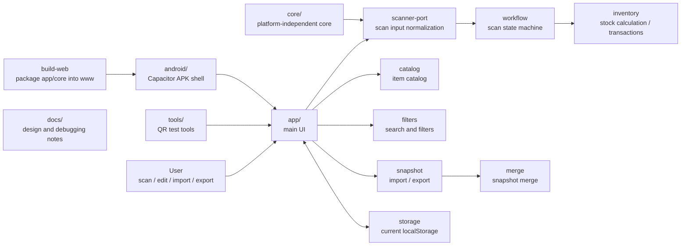

# Studio Inventory Manager

[中文](./README.md)

This project is an inventory manager for small studios. Its main goal is to make everyday actions like finding items, checking stock, printing labels, and moving inventory fast enough for real workshop use.

It is not just a QR-code generator. QR codes are the input layer. The real goal is to know what an item is, where it is, how much is left, and record changes with as little friction as possible.

## Use Cases

It is designed for:

- 3D printing filament spools: PLA, PETG, ABS, TPU, and similar materials.
- Small hardware parts: threaded inserts, screws, bearings, connectors, and fasteners.
- Tools, consumables, spare parts, boxes, shelves, and storage locations.

Typical workflows:

- Scan an item code to check stock and location.
- Scan a weight code plus an item code to update remaining filament or estimated part quantity.
- Scan a location code plus an item code to bind a new location.
- Generate labels for new items so future actions start from scanning.
- Export snapshots for future WebDAV sync or backup recovery.

## Philosophy

```text
scan -> calculate -> update, ideally within 10 seconds.
```

Design priorities:

- Offline first: stock lookup and stocktaking should work without network access.
- Simple input: scan results are plain strings such as `weight:`, `spool:`, `part:`, and `location:`.
- Reusable core: inventory rules, workflow state, and snapshot merge logic live in `core/`, independent of Android or browsers.
- Sync as an add-on: local writes should complete first; WebDAV sync can merge snapshots later.
- Printing after the core loop: label printing is useful output, not a dependency of the inventory workflow.

## Current Shape

The first version has the core loop working:

- Scan workbench.
- Spool and part catalog.
- Inventory search, filters, and low-stock checks.
- Archive, restore, clone, and automatic ID generation.
- QR label preview.
- Transaction log.
- JSON snapshot import, export, merge, and merge preview.
- Local Web version and Capacitor Android shell.

Payload protocol:

```text
weight:712.4
spool:PLA-BLK-001
part:M3-INSERT
location:RACK-A01
```

Scan input boundary:

```js
window.StudioInventoryScanner.push("spool:PLA-BLK-001");
window.StudioInventoryScanner.push({ rawValue: "weight:712.4" });
```

Any scanner source that can pass payloads into this bridge can reuse the same inventory workflow.

## Structure Map



## Directories

| Path | Purpose |
|---|---|
| `app/` | Main UI. The first screen is the scan workbench. |
| `core/` | Platform-independent business logic. |
| `tools/` | QR payload test tools. |
| `android/` | Capacitor Android shell. |
| `scripts/` | Build helper scripts. |
| `tests/` | Core workflow tests. |
| `docs/` | Design, debugging, and development notes. |

## Roadmap

Near term:

- Replace manual input with Android native scanning.
- Replace localStorage with SQL.js + Capacitor Filesystem.
- Add WebDAV snapshot sync.
- Add label templates and BLE printing.

Mid term:

- Batch item import.
- Location and shelf-based inventory views.
- More detailed merge conflict previews.
- Release signing and versioned releases.

Long term:

- Use the phone as the main inventory device with a LAN serving mode.
- Let desktop browsers access the same inventory.
- Natural language assistant queries like: "How much black PLA is left?" and "Which items are low stock?"

## Documentation

Start from [docs/README.md](./docs/README.md).

- [docs/00-project-map.md](./docs/00-project-map.md): file responsibilities.
- [docs/01-qr-input-workflows.md](./docs/01-qr-input-workflows.md): QR input workflows.
- [docs/02-android-apk.md](./docs/02-android-apk.md): Android APK path.
- [docs/03-data-and-sync.md](./docs/03-data-and-sync.md): local data and sync.
- [docs/04-next-steps.md](./docs/04-next-steps.md): next tasks.
- [docs/05-catalog-management.md](./docs/05-catalog-management.md): catalog rules.
- [docs/06-inventory-filters.md](./docs/06-inventory-filters.md): inventory filters.
- [docs/07-core-shell-boundary.md](./docs/07-core-shell-boundary.md): core/shell boundary.
- [docs/08-first-version-app.md](./docs/08-first-version-app.md): first version status and verification.
