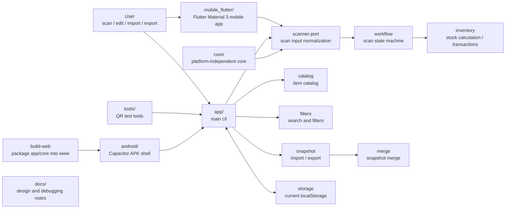

# Maker Studio Inventory Manager

[中文](./README.md)

This project is an inventory manager for personal studios, maker spaces, and small 3D printing work areas. It is designed for 3D printing filament, hardware parts, tools, spare parts, and storage locations.

Its main goal is to make everyday actions like identifying items, checking remaining stock, printing labels, moving inventory, and exporting backups fast enough for repeated use at a real workbench.

It is not just a QR-code generator. QR codes are the input layer. The real goal is to know what an item is, where it is, how much is left, and record changes with as little friction as possible.

Online QR test tool:

```text
https://llleeeqi.github.io/maker-studio-inventory/tools/
```

## Use Cases

It is designed for:

- 3D printing filament spools: PLA, PETG, ABS, TPU, and similar materials.
- Small hardware parts: threaded inserts, screws, bearings, connectors, and fasteners.
- Tools, consumables, spare parts, boxes, shelves, and storage locations.

Typical workflows:

- Scan an item code to confirm the item and current stock.
- Scan a weight code plus an item code to update remaining filament or estimated part quantity.
- Scan a location code plus an item code to bind a new location.
- Generate labels for new items so future actions start from scanning.
- Export snapshots for future WebDAV sync or backup recovery.

## Philosophy

```text
scan -> calculate -> update, ideally within 10 seconds.
```

Design priorities:

- Offline first: stock lookup and stocktaking should work without network access.
- Simple input: scan results are plain strings such as `weight:`, `spool:`, `part:`, and `location:`.
- Reusable core: inventory rules, workflow state, and snapshot merge logic live in `core/`, independent of Android or browsers.
- Sync as an add-on: local writes should complete first; WebDAV sync can merge snapshots later.
- Printing after the core loop: label printing is useful output, not a dependency of the inventory workflow.

## Current Shape

The first version has the core loop working:

- Scan workbench.
- Spool and part catalog.
- Inventory search, filters, and low-stock checks.
- Archive, restore, clone, and automatic ID generation.
- QR label preview.
- Transaction log.
- JSON snapshot import, export, merge, and merge preview.
- Local Web version, Capacitor Android shell, and Flutter Android 0.2.2 mobile package.

Current installable Flutter APK:

[studio-inventory-flutter-0.2.2-arm64-release.apk](https://github.com/llleeeqi/maker-studio-inventory/releases/download/v0.2.2/studio-inventory-flutter-0.2.2-arm64-release.apk)

This package is built with Flutter, Dart, Material 3, and the native Android build chain. Its package name is `studio.inventory.mobile`, version `0.2.2`. The distributable APK is an arm64 release build; debug APKs are only for local testing. SHA-256: `9dc285cfaf57abe5caab7b3fc41b53b55dc31226d557622c166144da9ea4df90`.

Recommended long-term payload protocol:

```text
msi:v1;type=spool;id=PLA-BLK-001;name=Black PLA;brand=Bambu;material=PLA;color=black;full_g=1200;tare_g=200;net_g=1000;created_on=260613
msi:v1;type=part;id=M3-SCREW-8-BLK;name=M3x8 black screw;category=screw;spec=M3x8;color=black;unit_weight_g=0.42;package_qty=100;created_on=260613
msi:v1;type=other;id=TOOL-001;name=Heat gun;note=nozzle kit;created_on=260613
msi:v1;type=location;id=RACK-A01;name=Rack A01;created_on=260613
msi:v1;type=weight;value_g=712.4
```

Design rules:

- QR codes store fixed profiles, not current weight, quantity, location, or stock status.
- Current stock state lives in local app data and only counts after a real stock-in action.
- All weight values use grams and keep `_g` in field names.
- All entity labels include `created_on=YYMMDD`.
- Location is optional and never blocks stock-in.

Legacy short payloads remain supported:

```text
weight:712.4
spool:PLA-BLK-001
part:M3-INSERT
location:RACK-A01
```

Scan input boundary:

```js
window.StudioInventoryScanner.push("spool:PLA-BLK-001");
window.StudioInventoryScanner.push({ rawValue: "weight:712.4" });
```

Any scanner source that can pass payloads into this bridge can reuse the same inventory workflow.

## Structure Map



## Directories

| Path | Purpose |
|---|---|
| `app/` | Main UI. The first screen is the scan workbench. |
| `mobile_flutter/` | Flutter / Dart / Material 3 Android mobile app. |
| `core/` | Platform-independent business logic. |
| `tools/` | QR payload test tools. |
| `android/` | Capacitor Android shell. |
| `scripts/` | Build helper scripts. |
| `tests/` | Core workflow tests. |
| `docs/` | Design, debugging, and development notes. |

## Roadmap

Near term:

- Continue the Flutter Android app as the primary phone entry, with high-frequency scanning, haptics, sound, and torch controls handled through Android-native capabilities where appropriate.
- Implement the `msi:v1` protocol, fixed Profile data, current State data, and Transaction logs.
- Add local JSON snapshot export/import on the phone.
- Update the QR test site to generate full-field `spool / part / other / location / weight` test payloads.

Mid term:

- Add WebDAV snapshot sync.
- Validate label printing through the vendor Web/JS SDK.
- Batch item import.
- Location and shelf-based inventory views.
- More detailed merge conflict previews.
- Natural language assistant queries like: "How much black PLA is left?" and "Which items are low stock?"
- Research a Docker server + progressive PWA path, including mobile browser scanning, offline support, and performance limits.
- Release signing and versioned releases.

Long term:

- Use a Docker server as the shared data host, with phones and desktops accessing it through a PWA.
- Keep the Android APK as the high-frequency scanning entry if PWA scanning or offline performance is not good enough.
- Multi-device collaboration, permissions, and backup recovery workflows.

## Documentation

Start from [docs/README.md](./docs/README.md).

- [docs/00-project-map.md](./docs/00-project-map.md): file responsibilities.
- [docs/01-qr-input-workflows.md](./docs/01-qr-input-workflows.md): QR input workflows.
- [docs/02-android-apk.md](./docs/02-android-apk.md): Android APK path.
- [docs/03-data-and-sync.md](./docs/03-data-and-sync.md): local data and sync.
- [docs/04-next-steps.md](./docs/04-next-steps.md): next tasks.
- [docs/05-catalog-management.md](./docs/05-catalog-management.md): catalog rules.
- [docs/06-inventory-filters.md](./docs/06-inventory-filters.md): inventory filters.
- [docs/07-core-shell-boundary.md](./docs/07-core-shell-boundary.md): core/shell boundary.
- [docs/08-first-version-app.md](./docs/08-first-version-app.md): first version status and verification.
- [docs/11-flutter-android-app.md](./docs/11-flutter-android-app.md): Flutter Android app route and build record.
- [docs/12-msi-v1-and-0.2-scope.md](./docs/12-msi-v1-and-0.2-scope.md): msi:v1 QR protocol and 0.2 mobile-local workflow scope.
