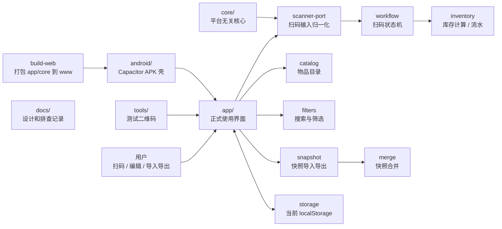

# 工作室物品管理

[English](./README.en.md)

这是一个给小工作室用的库存管理项目，核心目标是把“找东西、盘库存、贴标签、移动库位”这些琐碎动作做得足够快。

项目不是单纯的二维码生成器。二维码只是入口，真正要解决的是：物品在工作室里流动时，用户能用扫码快速知道它是谁、在哪、还剩多少，并把变化记录下来。

## 用途

适合管理这些东西：

- 3D 打印耗材卷：PLA、PETG、ABS、TPU 等。
- 小五金零件：热熔螺母、螺丝、轴承、连接件等。
- 工具、耗材、备件、盒子和货架库位。

典型动作：

- 扫物品码，快速确认物品身份和当前余量。
- 扫重量码和物品码，自动更新耗材余量或零件估算数量。
- 扫库位码和物品码，快速绑定新位置。
- 给新增物品生成标签，后续所有操作从扫码开始。
- 导出快照，后续做 WebDAV 同步或备份恢复。

## 核心理念

```text
扫码 -> 算出 -> 更新，尽量 10 秒内完成。
```

设计上优先保证：

- 离线可用：工作室没网也能查和记。
- 输入简单：扫码结果只是 `weight:` / `spool:` / `part:` / `location:` 这类字符串。
- 核心可复用：库存计算、状态机、快照合并都放在 `core/`，不绑死 Android 或浏览器。
- 同步外挂：本地先写成功，同步后续用 WebDAV 合并，不让网络阻塞盘点。
- 打印后置：标签打印是输出能力，不影响库存主流程。

## 当前形态

第一版已经跑通了核心闭环：

- 快捷扫码工作台。
- 耗材卷和零件目录。
- 库存搜索、筛选、低库存判断。
- 归档、恢复、克隆和自动 ID。
- 标签二维码预览。
- 流水记录。
- JSON 快照导入、导出、合并和预览。
- Web 检测版和 Capacitor Android 壳。

扫码协议：

```text
weight:712.4
spool:PLA-BLK-001
part:M3-INSERT
location:RACK-A01
```

扫码输入边界：

```js
window.StudioInventoryScanner.push("spool:PLA-BLK-001");
window.StudioInventoryScanner.push({ rawValue: "weight:712.4" });
```

任何扫码来源只要能把 payload 交给这个入口，就能复用同一套库存流程。

## 结构图



## 目录

| 路径 | 作用 |
|---|---|
| `app/` | 正式使用界面，第一屏是扫码工作台 |
| `core/` | 平台无关业务核心 |
| `tools/` | 测试二维码工具 |
| `android/` | Capacitor Android 壳 |
| `scripts/` | 构建辅助脚本 |
| `tests/` | 核心流程测试 |
| `docs/` | 设计、排查、后续开发记录 |

## 后续方向

近期：

- Android 原生扫码替换手动输入。
- SQL.js + Capacitor Filesystem 替换 localStorage。
- WebDAV 快照同步。
- 标签模板和精臣 BLE 打印。

中期：

- 批量导入物品。
- 按库位/货架组织库存视图。
- 更细的合并冲突预览。
- 自然语言助手查询：“黑色 PLA 还剩多少？”“哪些东西低库存？”
- Docker 服务端 + PWA 渐进式路线调研，评估手机浏览器扫码、离线能力和性能边界。
- release 签名包和版本发布流程。

远期：

- Docker 服务端承载共享数据，手机和桌面通过 PWA 访问。
- 如果 PWA 扫码和离线性能不够，再保留 Android APK 作为高频扫码主入口。
- 多设备协作、权限和备份恢复流程。

## 文档

从 [docs/README.md](./docs/README.md) 开始看。

- [docs/00-project-map.md](./docs/00-project-map.md)：文件分工。
- [docs/01-qr-input-workflows.md](./docs/01-qr-input-workflows.md)：二维码输入流程。
- [docs/02-android-apk.md](./docs/02-android-apk.md)：Android APK 路线。
- [docs/03-data-and-sync.md](./docs/03-data-and-sync.md)：本地数据和同步。
- [docs/04-next-steps.md](./docs/04-next-steps.md)：下一阶段清单。
- [docs/05-catalog-management.md](./docs/05-catalog-management.md)：物品目录规则。
- [docs/06-inventory-filters.md](./docs/06-inventory-filters.md)：库存筛选。
- [docs/07-core-shell-boundary.md](./docs/07-core-shell-boundary.md)：核心和外壳边界。
- [docs/08-first-version-app.md](./docs/08-first-version-app.md)：第一版状态和验证。
